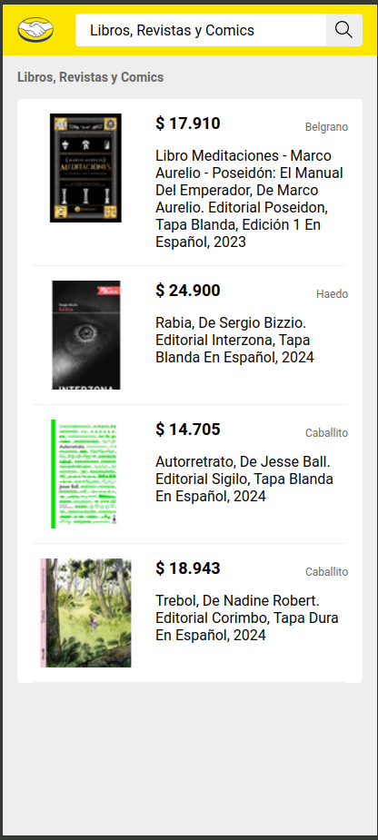

# MercadoLibre Challenge

Prueba Frontend Mercadolibre

## Tabla de contenidos

- [MercadoLibre Challenge](#mercadolibre-challenge)
  - [Tabla de contenidos](#tabla-de-contenidos)
  - [Instrucciones](#instrucciones)
  - [Stack utilizado](#stack-utilizado)
  - [Usabilidad](#usabilidad)
  - [Escalabilidad](#escalabilidad)
  - [Performance](#performance)
  - [SEO](#seo)
  - [Testing](#testing)

## Instrucciones

- Ejecutar `npm install` en la raiz del proyecto y instalara las dependencias del backend como las de la carpeta frontend
- Ejecutar `npm run dev` en la raiz del proyecto , ejecutara tanto el servidor the backend con nodejs y express y el front con react por medio de concurrently.
- Puerto para FrontEnd 5173
- Puerto Para Backend 7000

## Stack utilizado

    -Frontend
    -React
    -Sass
    -Vite
    -ReactQuery
    -Vitest
    -Helmet (SEO)

    -Backend
    -NodeJs
    -Express

## Usabilidad

- Agregue componentes que le permiten al usuario saber si algo no esta funcionando bien como cuando no se ecuentran resultados:

- Tambien cuando esta en proceso la busqueda de items agregue componentes Skeleton que se renderizan mientras la informacion termina de cargar:

- En cuanto al camop de busqueda, Agregue la propiedad Focus una vez este se envia vacio para informarle al usuario que se debe diligenciar, copiando el funcionamiento de la web oficial:

- Agrege estilos sencillos para Mobile con la intencion de mantener la aplicacion usable en cualquier dispositivo:

 

## Escalabilidad

- Utilice una arquitectura modular, separando tanto las vistas como la capa de datos y servicios. Tanto el frontend como el backend permiten una actualizacion sencilla, y se podrian agregar nuevas funcionalidades, rutas o estilos de forma aislada y escalable.

## Performance

- Utilice la biblioteca ReactQuery para manejar eficientemente el data fetching y caching desde el front.
- Manejo de errores tanto desde el front como desde el back.

## SEO

- Utilice la biblioteca `react-helmet-async` para agregar dinamicamente Metadatos en la cabecera de las paginas, como por ejemplo el nombre de la busqueda o el nombre del articulo que se esta visualizando.

## Testing

- Se crearon casos de test sencillos para algunos componentes del front, tanto en renderizado como en funcionalidad con mock de datos para las respuestas de los servicios
  para ejectutarlos una vez en la raiz del proyecto ejecutar `npm run test:frontend` o `npm run test:frontend:ui`

  
